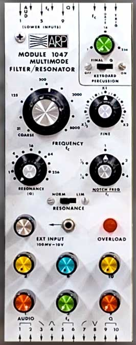

# Resumo

Computadores analógicos são utilizados em aplicações como inteligência artificial, redes neurais, medicina e simulação de processos físicos complexos, pois oferecem ganhos de eficiência e velocidade em relação aos métodos digitais. Têm a capacidade de resolver equações diferenciais ordinárias e simular o comportamento de sistemas dinâmicos contínuos[^1], características presentes em alguns sintetizadores e módulos de processamento de áudio.

O objetivo deste trabalho de conclusão de curso é compreender e recriar o [filtro/ressonador multimodo ARP 1047](https://reverb.com/en-br/news/a-brief-history-of-the-arp-2500), explorando suas bases na computação analógica e sua aplicabilidade na síntese sonora. A pesquisa envolve a análise do circuito original, sua simulação e a construção de um protótipo funcional. Além disso, busca-se avaliar seu desempenho, comparando suas características com o projeto original e investigando possíveis melhorias.

# Estudo

## Amplificadores Operacionais (Op-Amps)

+ [ ] O que são
+ [ ] inversor, não-inversor, somador
+ [ ] simular e testar configurações básicas
+ [ ] [bibliografia](./bibliografia.qmd)

---

[¹]: ULMANN, Bernd. **Analog and Hybrid Computer Programming**. Walter de Gruyter GmbH, 2020
